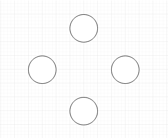
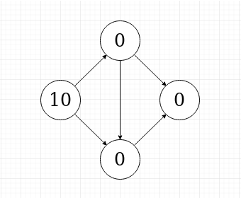
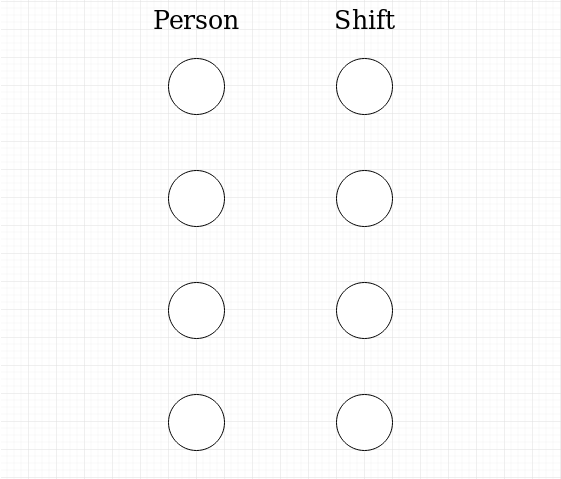
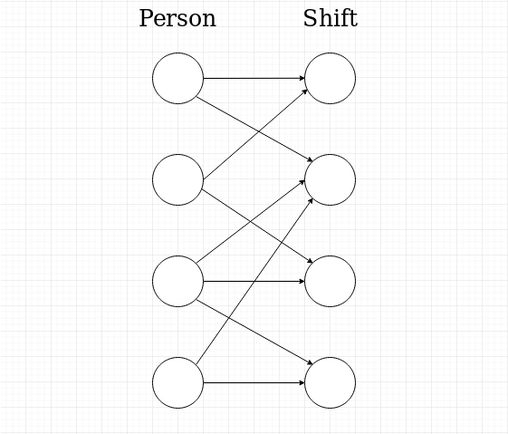
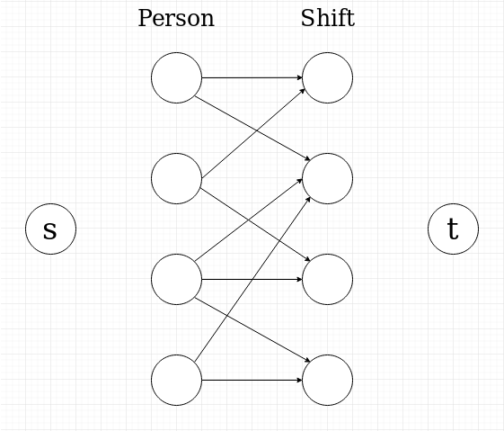
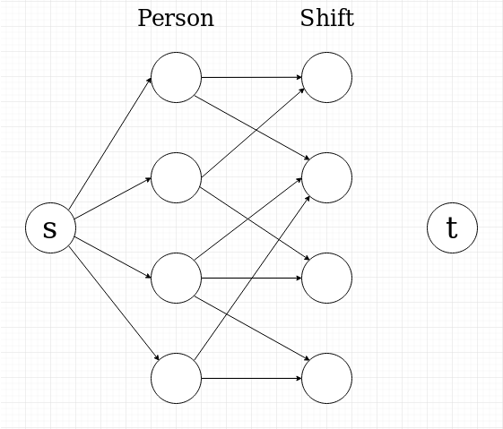
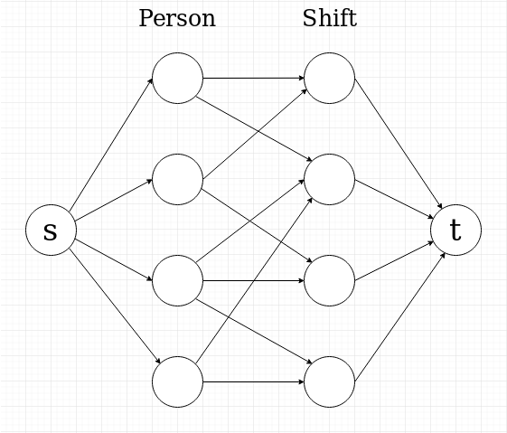
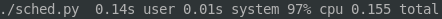

---
title: Optimal Shift Scheduling
subtitle: An application of Network Flow algorithms
date: April 2019
output:
  slidy_presentation:
    css: styles.css
---

# Problem

::: incremental

- some *x* number of people

- some *y* number of shifts

- each person may or may not be assigned to any shift; there are $x \times 2^y$ possible schedules

- that's a lot

- we have to account for matching shift availability too

:::

# Naive solutions - Push reassignment

::: incremental

- for each person's availability, iterate possible shifts in order

- if the shift is available, and their total hours is below some limit, assign the person to that shift

- if no shifts are available, and their total hours is below some minimum, unassign some person from some filled shift, and take their place

- repeatedly displace and reassign people until all availability is satisfied

- repeat for every person

- upper bound of $x^2$ reassignments for an optimal schedule

- **Problem:** if a perfect schedule does not exist, this algorithm may never terminate

:::

# Naive solutions - Guess and check (brute force)

::: incremental

- check all $x \choose y$ possible schedules

- check how many people are assigned to shifts that fit their availability

- keep the schedule with the most matches

- **Problem:** for 100 employees and 300 shifts, there are 10^92 possible schedules (about a trillion schedules per atom in the observable universe)

- we don't have time for that

:::

# Approximation solution

::: incremental

- iterate availability and assign shifts in order

- if no shifts are available, assign a shift outside of the person's availability

- only need to make *x* assignments

- **Pros:** most impressive number of mismatches of all methods

- **Cons:** we want to minimize the number of mismatches

:::

# Network Flow

- Now we have to step back.

- Suppose we have some nodes.

# Network Flow

- Now we have to step back.

- Suppose we have some nodes.

- Lets give them values.

# Network Flow

- Now we have to step back.

- Suppose we have some nodes.

- Lets give them values. And edges.

- This is called a *graph*

::: incremental

- We can *push* some amount of flow along these edges to move it to other nodes.

- This can tell us whether two nodes are connected along some path, but not much more.

:::

# Network Flow

- Suppose there are capacities on the edges restricting how much flow can be pushed along each one.

- A natural problem is wanting to know the maximal amount of flow that can be pushed from one node to another.

- Here, we would like to know how much flow we could push from the source "s" to the sink "t". (try it)

# Network Flow

- Suppose there are capacities on the edges restricting how much flow can be pushed along each one.

- A natural problem is wanting to know the maximal amount of flow that can be pushed from one node to another.

- Here, we would like to know how much flow we could push from the source "s" to the sink "t". (try it)

- It turns out to be 20.

# Network Max Flow solution

- The *Max Flow* problem can be solved in a relatively short amount of time in relation to the number of nodes and edges.

- By carefully pushing flow along paths and filling the number of free paths available, a maximal solution can be found.

- This is implemented in the [Edmonds-Karp algorithm](https://en.wikipedia.org/wiki/Edmonds%E2%80%93Karp_algorithm); the details of how it works are beyond this demo.

# Okay but I don't care about "network flow"

::: incremental

- We need another tool before doing anything useful with this.

:::

# Bipartite matching

- Now suppose we have a graph made up of two distinct groups of nodes, arranged into two columns.

# Bipartite matching

- Let's label the groups like this:

::: incremental

- Each person is given a node

- Each shift is also given a node

:::

# Bipartite matching

- Let's add edges to connect people to shifts they are available for:

# Bipartite matching

- Is this starting to look familiar?

::: incremental

- The central edges have a capacity of 1, where a flow of 1 means the person is assigned to the shift, and a flow of 0 means they are not.

:::

# Optimal shift scheduling

- Is this starting to look familiar?

- The central edges have a capacity of 1, where a flow of 1 means the person is assigned to the shift, and a flow of 0 means they are not.

- We can add edges from the source to each person, with capacities equal to the max number of shifts that can be assigned for that person.

# Optimal shift scheduling

- Is this starting to look familiar?

- The central edges have a capacity of 1, where a flow of 1 means the person is assigned to the shift, and a flow of 0 means they are not.

- We can add edges from the source to each person, with capacities equal to the max number of shifts that can be assigned for that person.

- We can add edges from each shift to the sink, with capacities equal to the number of people to be assigned to that shift.

# Optimal shift scheduling

::: incremental

- With the shift matching problem now set up as a flow network, it can be solved to find the maximum flow that can be pushed from *s* to *t*. We can use a modified version of the Edmonds-Karp algorithm which ensures a shift assignment does not exceed a person's maximum number of hours.

- We can keep track of the central edges used to find the max flow. Central edges assigned a flow value of 1 indicate the person is assigned to the shift.

- By reversing the graph back into availability assignments, we obtain a schedule with a maximal number of matches between availabilty and shifts.

:::

# Bonus

By modifying the reduction to the flow network graph, we can implement additional features:

- Edges with different priority can be used, which can allow for *some* shifts to be suggested outside of a person's stated availability in order to fill staff requirements for shifts.

- Shifts can be grouped by location to prioritize being assigned to the same location in the same day, or to prioritize being assigned one location over any other.

- Specific people can be given priority for being assigned their available shifts, even if it means decreasing the maximal number of matches.

- Soft priorities can be added to assign shifts to people in a specific order, but allow flexibility to accomodate people with limited availability.

- To re-schedule *some* of a schedule and keep some assignments, the process can be repeated with just the unassigned people and shifts.

# Performance

- Is this any better than the other methods?

# Performance

- Is this any better than the other methods?

 (Yes)

- Optimal solution completed in 155 milliseconds (computers are fast).

# Conclusion

- That's it.

- Press C for a table of contents.

- Have a cool day.
